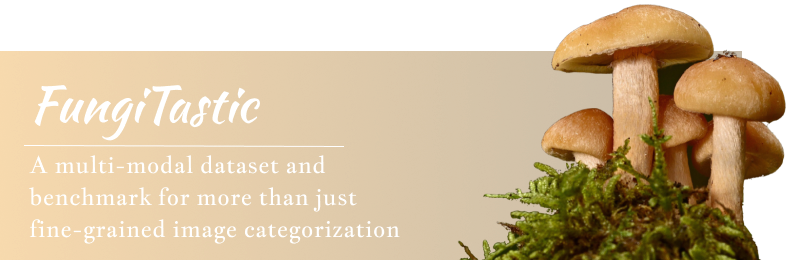

# Dataset
FungiTastic is a machine learning dataset for classification of fungi from images and metadata.

## Statistics
[Plots will appear here]

# Evaluation
Lorem impsun.
## Baseline methods

# Paper
[Link will appear here]
BibTex citation:
