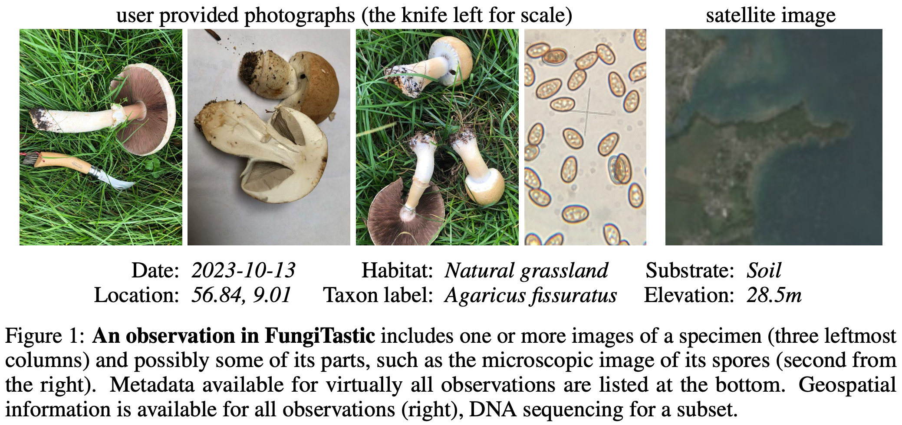
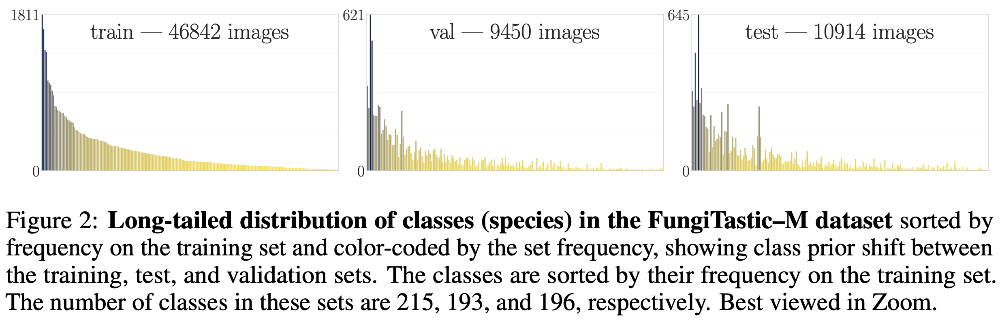

## Multi-Modal Machine Learning Dataset

FungiTastic is a comprehensive multi-modal machine learning dataset for classification of fungi from images and metadata.

The fungi observations include photographs, satellite images, meteorological observations, segmentation masks, and textual metadata. The metadata enrich the observations with attributes such as the timestamp, camera settings, GPS location, and information about the substrate, habitat, and biological taxonomy.
By incorporating various modalities, the dataset support a robust benchmark for multi-modal classification, enabling the development and evaluation of sophisticated machine learning models under realistic and dynamic conditions.

See an example of input data in Figure 1 below:

### Datasets and Subsets

__Closed and open set__:  We define two types of classes: "unknown," with no examples in the training set, used in evaluation of open-set recognition; and the remaining classes are tagged "known", i.e. those present in the training set, used for both open and closed set recognition.

__Train, val, test__: The FungiTastic–train dataset consists of all observations up to the end of 2021, the FungiTastic–val and FungiTastic–test datasets encompass all observations from 2022 and 2023, respectively.

__FungiTastic–M__ (mini)  is a compact and challenging subset of the FungiTastic dataset consisting of all observations belonging to 6 hand-picked genera primarily targeted for prototyping. These genera form fruit bodies of the toadstool type with a large number of species. 

FungiTastic–FS subset, FS for few-shot, is formed by species with less than 5 observations in the training set, which were removed from the main dataset. The subset contains 4,293 observations encompassing 7,819 images of a total of 2,427 species. As in the FungiTastic – closed set data, the split into validation and testing is done according to the year of acquisition.

## Statistics

In total, Fungitastic contains over 650k images from 350k observations.

The observations in the dataset have a long-tailed class (species) distribution, as can be seen in Figure 2:

The table below summarizes the statistics of different subsets:

| Dataset | Subset | Observations | Images | Classes | Unknown classes | Metadata | Masks | Microscopic |
|---------|--------|--------------|--------|---------|-----------------|----------|-------|-------------|
| FungiTastic Closed Set | Train. | 246,884 | 433,701 | 2,829 | - | ✓ | - | ✓ |
| | Val. | 45,616 | 89,659 | 2,306 | - | ✓ | - | ✓ |
| | Test. | 48,379 | 91,832 | 2,336 | - | ✓ | - | ✓ |
| | DNA | 2,041 | 5,117 | 725 | - | ✓ | ✓ | |
| FungiTastic-M Closed Set | Train. | 25,786 | 46,842 | 215 | - | ✓ | ✓ | ✓ |
| | Val. | 4,687 | 9,412 | 193 | - | ✓ | ✓ | ✓ |
| | Test. | 5,531 | 10,738 | 196 | - | ✓ | ✓ | ✓ |
| | DNA | 211 | 645 | 93 | - | ✓ | ✓ | ✓ |
| FungiTastic-FS Closed Set | Train. | 4,293 | 7,819 | 2,427 | - | ✓ | - | ✓ |
| | Val. | 1,099 | 2,285 | 570 | - | ✓ | - | ✓ |
| | Test. | 998 | 1,909 | 566 | - | ✓ | - | ✓ |
| FungiTastic Open Set | Train. | 246,884 | 433,701 | 2,829 | - | ✓ | - | ✓ |
| | Val. | 47,453 | 96,756 | 3,360 | 1,054 | ✓ | - | ✓ |
| | Test. | 50,085 | 97,551 | 3,349 | 1,013 | ✓ | - | ✓ |
| FungiTastic-M Open Set | Train. | 25,786 | 46,842 | 215 | - | ✓ | - | ✓ |
| | Val. | 4,703 | 9,450 | 203 | 10 | ✓ | - | ✓ |
| | Test. | 5,587 | 10,914 | 230 | 34 | ✓ | - | ✓ |

# Evaluation and metrics

The dataset considers five different problems with corresponding metrics:

1. Fine-grained closed-set classification with heavy long-tailed distribution 

2. Standard closed-set classification with out-of-distribution (OOD) detection

3. Classification with non-standard cost functions

4. Classification on a time-sorted dataset for benchmarking adaptation methods

5. Few-shot classification of species with a small number of training observations

Please refer to the article for the detailed description of the problems and their metrics

## Baseline results

| Architectures | FungiTastic–M  224×224 ||| FungiTastic - 224×224 ||| FungiTastic–M  - 384×384 ||| FungiTastic - 384×384 |||
|---------------|:-----------------:|:-----------------:|:-----------------:|:-----------------:|:-----------------:|:-----------------:|:-----------------:|:-----------------:|:-----------------:|:-----------------:|:-----------------:|:-----------------:|
|               | **Top1** | **Top3** | **F₁ᵐ** | **Top1** | **Top3** | **F₁ᵐ** | **Top1** | **Top3** | **F₁ᵐ** | **Top1** | **Top3** | **F₁ᵐ** |
| ResNet-50 | 61.7 | 79.3 | 35.2 | 62.4 | 77.3 | 32.8 | 66.3 | 82.9 | 39.8 | 66.9 | 80.9 | 36.3 |
| ResNeXt-50 | 62.3 | 79.6 | 36.0 | 63.6 | 78.3 | 33.8 | 67.0 | 84.0 | 39.9 | 68.1 | 81.9 | 37.5 |
| EfficientNet-B3 | 61.9 | 79.2 | 36.0 | 64.8 | 79.4 | 34.7 | 67.4 | 82.8 | 40.5 | 68.2 | 81.9 | 37.2 |
| EfficientNet-v2-B3 | 65.5 | 82.1 | 38.1 | 66.0 | 80.0 | 36.0 | 70.3 | 85.8 | 43.9 | 72.0 | 84.7 | 41.0 |
| ConvNeXt-Base | 66.9 | 84.0 | 41.0 | 67.1 | 81.3 | 36.4 | 70.2 | 85.7 | 43.9 | 70.7 | 83.8 | 39.6 |
| ViT-Base/p16 | 68.0 | 84.9 | 39.9 | 69.7 | 82.8 | 38.6 | 73.9 | 87.8 | 46.3 | 74.9 | 86.3 | 43.9 |
| Swin-Base/p4w12 | **69.2** | **85.0** | 42.2 | 69.3 | 82.5 | 38.2 | 72.9 | 87.0 | 47.1 | 74.3 | 86.3 | 43.3 |
| BEiT-Base/p16 | 69.1 | 84.6 | **42.3** | 70.2 | 83.2 | **39.8** | **74.8** | **88.3** | **48.5** | **75.3** | **86.7** | **44.5** |

# Paper
[Link and BibTex data will appear here]