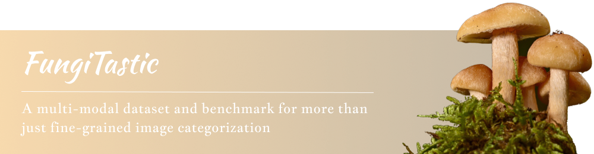

  

## 📝 Description

We introduce a new, highly challenging benchmark and a dataset -- **FungiTastic** -- based on data 
continuously collected over a twenty-year span.
The dataset originates in fungal records labeled and curated by experts. 
It consists of about 350k multi-modal observations that include more than 650k photographs 
from 5k fine-grained categories and diverse accompanying information, 
e.g., acquisition metadata, satellite images, and body part segmentation.
FungiTastic is the only benchmark that includes a test set with partially DNA-sequenced ground
truth of unprecedented label reliability.
The benchmark is designed to support:
- standard close-set classification, 
- open-set classification,
- multi-modal classification, 
- few-shot learning, 
- domain shift, and many more.