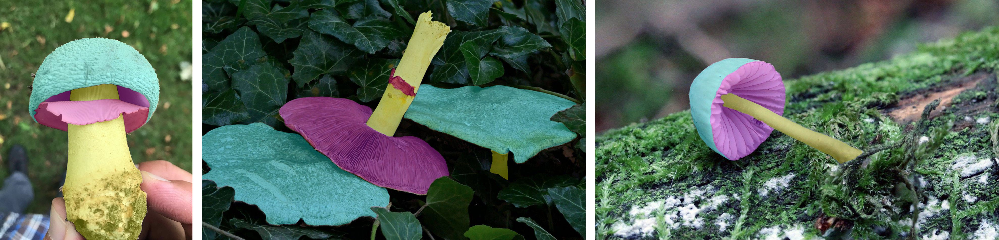

# ✂️ Segmentation Masks


Part-level segmentation masks capture key fungal structures (e.g., **cap, gills, pores, ring, stem**) allowing models to learn from diagnostic morphology and justify predictions. The annotations are provided as run-length-encoded (RLE) masks and support **binary**, **instance** and **semantic** segmentation, as well as **part-aware recognition** and explainability.  

Given the complexity of the task, we provide these masks only for the **Mini** subset.

> 💡 **Interactive example:** Explore how to load and visualize the masks directly in the → [Mask loading tutorial notebook](https://www.kaggle.com/code/picekl/fungitastic-segmentation-mask-loading)

---

## What you get and what for!

Real observations vary: species look alike, parts are partly occluded, and lighting/viewpoint changes. Part masks help models **focus on diagnostic morphology** and let you **explain predictions** by highlighting which parts mattered.

- **Parts (labels):** `cap`, `gills`, `pores`, `ring`, `stem` *(plus implicit `background`)*  
- **Intended tasks / use of the masks:**
    - **Binary segmentation** → evaluate per-pixel *fungi / background* (mIoU/Dice).  
    - **Instance segmentation** → evaluate per-part *instances* (COCO-style AP).  
    - **Semantic segmentation** → evaluate per-pixel *classes* (mIoU/Dice).  
    - **Part-aware classification** → pool features per part or attribute predictions to parts.

---

## Format

Masks are distributed as a **single Parquet file** with **run-length encoded (RLE)** masks per image and part.  
This is compact and fast to load, while remaining compatible with COCO tooling.

**File:** `FungiTastic-Mini-ValidationMasks.parquet`  
**One row = one part instance** for one image, with columns:

| Column      | Meaning                                                                         |
|-------------|---------------------------------------------------------------------------------|
| `file_name` | Relative path of the image within the Mini subset                               |
| `label`     | Part name (`cap`, `stem`, `gills`, `pores`, `ring`, optionally `fruiting_body`) |
| `width`     | Image width                                                                     |
| `height`    | Image height                                                                    |
| `rle`       | **Uncompressed CVAT RLE** list `[start, length, ...]` for that instance         |

> **Why RLE?** Run-length encoding stores masks efficiently and can be decoded with `pycocotools.mask.decode`.

---

## Two ways to use the masks

You have **two complementary access paths**. Pick the one that fits your pipeline.

> ⚠️ The snippets below are **minimal “dummy” examples** (may need adaptation / paths).  
> For **tested, end-to-end code**, see the **[Mask loading tutorial notebook](https://www.kaggle.com/code/picekl/fungitastic-segmentation-mask-loading)**.


### 1. Use the dedicated Class

`MaskFungiTastic` loads images and decodes masks for you, with simple **modes** depending on the task:

```python
from dataset.fungi import MaskFungiTastic

# Semantic segmentation (returns a single-channel class map)
ds_sem = MaskFungiTastic(split="val", subset="Mini", size="300", mode="semantic")

# Instance segmentation (returns image + list of instances with category_id + binary masks)
ds_ins = MaskFungiTastic(split="val", subset="Mini", size="300", mode="instance")

# Binary mask for a single part (e.g., cap-only)
ds_cap = MaskFungiTastic(split="val", subset="Mini", size="300", mode="binary", class_name="cap")

img, mask = ds_sem[0]   # image (PIL/ndarray), semantic mask (H×W, uint8)
```

### 2. Decode RLE directly

Load the Parquet and turn rle into a mask on the fly:

```python
import pandas as pd, numpy as np
from pycocotools import mask as m
from PIL import Image
import os

df = pd.read_parquet(".../FungiTastic-Mini-ValidationMasks.parquet")
row = df.iloc[0]
H, W = int(row["height"]), int(row["width"])
mask = m.decode({"counts": row["rle"], "size": [H, W]}).astype(np.uint8)  # 0/1
img = Image.open(os.path.join(".../images", row["file_name"]))  # RGB
```