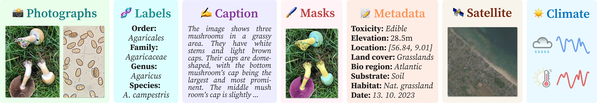

<p align="center">
  
</p>

<p align="center">
  <a href="https://github.com/bohemianvra/FungiTastic"></a>
  <a href="https://github.com/bohemianvra/FungiTastic/issues"></a>
  <a href="https://github.com/bohemianvra/FungiTastic/pulls"></a>
  <a href="https://github.com/bohemianvra/FungiTastic/blob/main/LICENSE"></a>
</p>

# 🍄 Welcome to FungiTastic!

**FungiTastic** is a large-scale, expert-verified, multi-modal dataset and toolkit for benchmarking and research in wild fungi recognition, discovery, and biodiversity monitoring.  
Whether you’re here to push the limits of vision models, explore new multi-modal learning, or build better biodiversity monitoring tools, you’re in the right place!

---

## 🔎 Key Resources

| Resource                                                       | Link                                                               |
| -------------------------------------------------------------- | ------------------------------------------------------------------ |
| Dataset paper (CVPR 2025, FGVC Workshop; details & benchmarks) | [arXiv PDF](https://arxiv.org/pdf/2408.13632)                      |
| GitHub repo (code, loaders, scripts, baselines)                | [GitHub](https://github.com/bohemianvra/FungiTastic)               |
| Starter notebooks (baseline pipelines & scripts)               | [Kaggle](https://www.kaggle.com/datasets/picekl/fungitastic/code)  |
| Download & usage guide (subsets, modalities, instructions)     | [Guide](https://bohemianvra.github.io/FungiTastic/usage/download/) |


---

## 🏞️ Dataset Overview

FungiTastic is a large-scale (~350,000 observations and &gt;600,000 images), multi-modal benchmark dataset for computer vision, machine learning, and biodiversity research, centered around wild fungi observations. It offers expert-labeled data across more than 5,000 species, collected over 20+ years, and is designed to power research in fine-grained recognition, domain adaptation, multi-modal learning, open-set recognition, and more.


**Figure1:** A Fungi observation includes one or more photos [🟩] with expert-verified labels, sometimes spores, and rich contextual data: captions [🟦], metadata [🟧], geospatial [🟫], and climatic time-series [🟦]. For a subset (~70k images), body part masks [🟥] are included.

---

## 🧑‍🔬 What Can You Do With FungiTastic?

- **Fine-grained classification** (closed-set, open-set)
- **Few-shot learning** and rare species recognition
- **Multi-modal and multi-task learning** (mix visual, tabular, geospatial, text)
- **Domain adaptation & temporal shift** (yearly, seasonal, and habitat variation)
- **Vision-language modeling** (rich captions)
- **Semantic/instance segmentation**
- **Cost-sensitive classification** (e.g., edible vs. poisonous)

> See [Benchmarks](./benchmarks.md) for benchmark challenges and usage.

---

## 📚 Dataset Subsets

- **Full**: ~346k observations, all modalities — *benchmark for classification and discovery*
- **Mini (FungiTastic–M)**: Focused on 6 genera, ~70k images with masks — *fast prototyping, segmentation, few-shot*
- **Few-shot (FungiTastic–FS)**: Species with <5 training samples — *test few-shot models & rare class learning*

> Full subset details and statistics in [Dataset](./dataset.md).

---

## 💾 Downloading the Data

**Two options:**

1. **Kaggle download**: Contains the majority of the data and images in 500px image resolution (~50GB)
2. **Download script (recommended):**  
   Download only what you need (by subset, modality, or resolution).
   ```
   git clone https://github.com/bohemianvra/FungiTastic.git
   cd FungiTastic/dataset
   python download.py --metadata --images --subset "m" --size "300" --save_path "./"
   ```
   See the [Download Guide](./usage/download.md) for all options.

---

## 📣 Get Involved

- **Issues or help?** [Open an Issue](https://github.com/bohemianvra/FungiTastic/issues)
- **Request a feature** or **contribute**? Fork & PR!

## Citation 
- When used, please use the following reference.
  ```
  @InProceedings{Picek_2025_CVPR,
      author    = {Picek, Lukas and Janouskova, Klara and Cermak, Vojtech and Matas, Jiri},
      title     = {FungiTastic: A Multi-Modal Dataset and Benchmark for Image Categorization},
      booktitle = {Proceedings of the Computer Vision and Pattern Recognition Conference (CVPR) Workshops},
      month     = {June},
      year      = {2025},
      pages     = {2046-2056}
  }
  ```

---

_Enjoy!_ 🍄