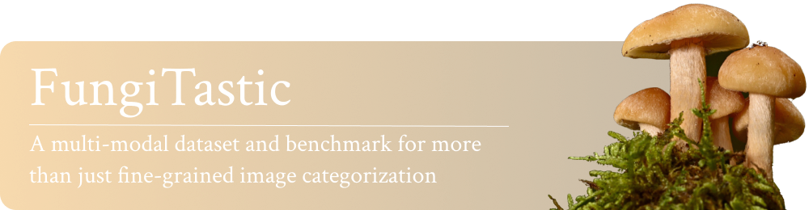

  
  
  
  
  
  
  

  

  <a href="https://github.com/bohemianvra/FungiTastic/issues/new?assignees=aerodynamic-sauce-pan&labels=bug&projects=&template=bug_report.md&title=%5BBUG%5D">Report Bug</a>
  ·
  <a href="https://github.com/bohemianvra/FungiTastic/issues/new?assignees=aerodynamic-sauce-pan&labels=enhancement&projects=&template=enhancement.md&title=%5BEnhancement%5D">Request Feature</a>

---

# FungiTastic 🧫🍄

`FungiTastic` is a Python toolkit designed for fungal image understanding, supporting tasks such as training classifiers, extracting features, computing similarities, and performing image retrieval or evaluation. It is designed to work with various fungal datasets and enables reproducible research in fungal taxonomy and visual recognition.

## Highlights

- 🔍 Support for local and global feature extraction
- 🤝 Similarity computation for retrieval and classification
- 🧪 Modular training, feature fusion, and evaluation pipelines
- 📦 Ready-to-use for fungal identification and research tasks

---
